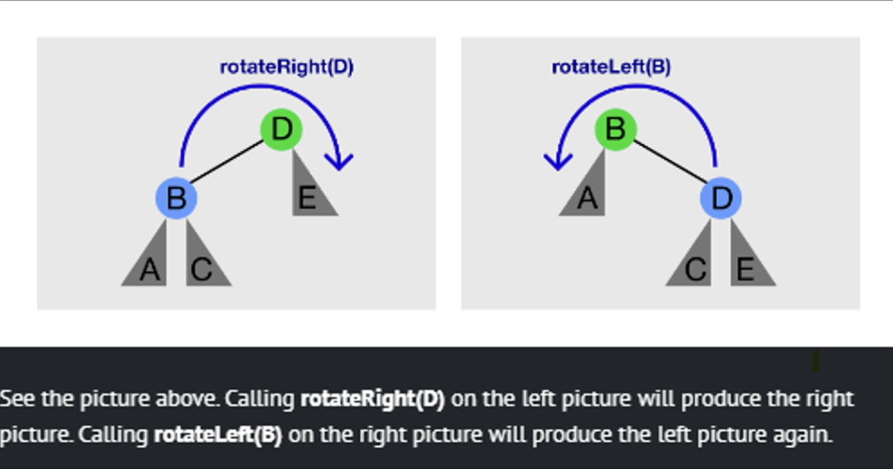
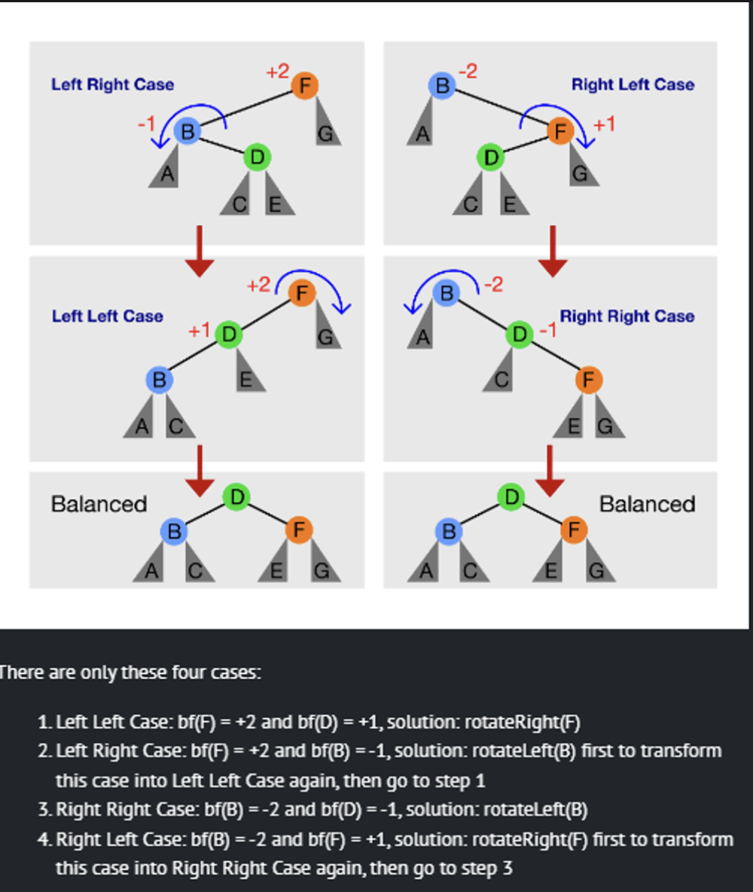

## AVL Tree `(extends BST)`

Self-balancing BST that maintains its height within a a logarithmic order ($O(\log N))$  relative to the number of vertices ($N$) present in the AVL Tree

For each vertex in the BST, we set a new attribute height → number of edges on the path from v to its **deepest** leaf. 

AVL trees ensure that height $h \leq 2 * \log_2N$, hence ,pst AVL tree operations run in $O(\log N)$  time complexity.

### Height(v)

Returns the height of the vertex v in the AVL tree (in $O(1)$  time)

v.height = -1 (if v is an empty tree)

v.height = max(v.left.height, v.right.height) + 1 (otherwise)

<aside>
💡 The height of the BST = `root.height`

</aside>

### bf(v)

Returns the balance factor of vertex v in the AVL tree (in $O(1)$  time)

$bf(v) =$ `v.left.height` - `v.right.height`

## AVL Invariance

A vertex v is height-balanced iff $|bf(v)| \leq 1$

A BST is an AVL tree iff every vertex in the BST is height-balanced

### AVL Tree with **N** vertices has height **$h < 2 * \log_2N$**

Let $N_h$ be the minimum number of vertices in a height-balanced AVL Tree of height $h$

For any AVL Tree with $N$  vertices, $N \geq N_h$

## Tree Rotations



**rotateRight(T)**/**rotateLeft(T)** can only be called if **T** has a left/right child, respectively.

Tree Rotation **preserves** BST property.

Before/After rotation, A < B < C < D < E despite subtree rooted at C (if it exists) changing parent

```java
BSTVertex rotateLeft(BSTVertex B) // pre-req: T.right != null
  BSTVertex D = B.right // rotateRight is the mirror copy of this
  D.parent = B.parent // which can be null if B is the root
  B.parent = D //B's parent is D
  B.right = D.left //change B.right to C
  if (D.left != null) 
		D.left.parent = B //change C's parent to B
  D.left = B //now B becomes D's left child
  // update the height of T and then w here
  return w
```



## Time Complexities

A**ll** BST operations (both update and query operations) that we have learned so far, if they have time complexity of $O(h)$, they have time complexity of $O(\log N)$ if we use AVL Tree version of BST.

## Minimum/Maximum num of vertices of height, h

$Maximum = 2^{h+1} -1$ 

$Minimum = Minimum(h-1) + Minimum(h-2) + 1$

| Height | Min Number of Vertices | Max Number of Vertices | 
| --- | --- | --- |
| 0 | 1 | 1 |  
| 1 | 2 | 3 |  
| 2 | 4 | 7 |  
| 3 | 7 | 15 |  
| 4 | 12 | 31 |  
| 5 | 20 | 63 |  
| 6 | 33 | 127 |  
| 7 | 54 | 255 |  
| 8 | 88 | 511 |  
| 9 | 143 | 1023 |  
| 10 | 232 | 2047 | 
| 11 | 376 | 4095 | 
| 12 | 609 | 8191 |  
| 13 | 986 | 16383 |  
| 14 | 1596 | 32767 |  
| 15 | 2583 | 65535 | 
| 16 | 4180 | 131071 | 
| 17 | 6764 | 262143 |
| 18 | 10945 | 524287 |
| 19 | 17710 | 1048575 | 
| 20 | 28656 | 2097151 |
| 21 | 46367 | 4194303 | 
| 22 | 75024 | 8388607 |  
| 23 | 121392 | 16777215 | 
| 24 | 196417 | 33554431 |  
| 25 | 317810 | 67108863 |  
| 26 | 514228 | 134217727 |  
| 27 | 832039 | 268435455 |  
| 28 | 1346268 | 536870911 |  
| 29 | 2178308 | 1073741823 |  
| 30 | 3524577 | 2147483647 |
| 31 | 5702886 | 4294967295 |
| 32 | 9227464 | 8589934591 |
| 33 | 14930351 | 17179869183 |
| 34 | 24157816 | 34359738367 |
| 35 | 39088168 | 68719476735 |
| 36 | 63245985 | 137438953471 |
| 37 | 102334154 | 274877906943 |
| 38 | 165580140 | 549755813887 |
| 39 | 267914295 | 1099511627775 |
| 40 | 433494436 | 2199023255551 |
| 41 | 701408732 | 4398046511103 |
| 42 | 1134903169 | 8796093022207 |
| 43 | 1836311902 | 17592186044415 |
| 44 | 2971215072 | 35184372088831 |
| 45 | 4807526975 | 70368744177663 |

## Max Height of AVL Tree given xx Vertices

$= \sqrt{2} \log ({2n})$

## Min Height of AVL Tree given xx Vertices

$= \lfloor \log (2n) \rfloor$

| Data Structure | Avg Insert | Avg Search | Avg Max/Min | Avg Succ/Pred |
| -------------- | ---------- | ---------- | ----------- | ------------- |
| AVL Tree       | $O(\log n)$ | $O(\log n)$ | $O(\log n)$  | $O(\log n)$    |
| Hash Table     | $O(1)$     | $O(1)$     | $O(n)$      | $O(n)$         |
