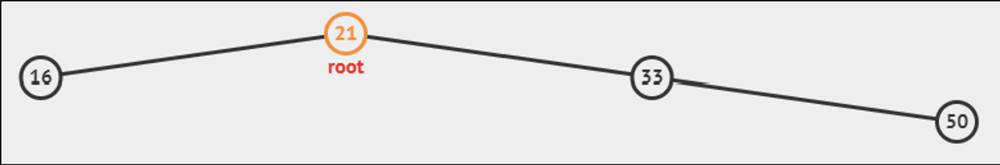
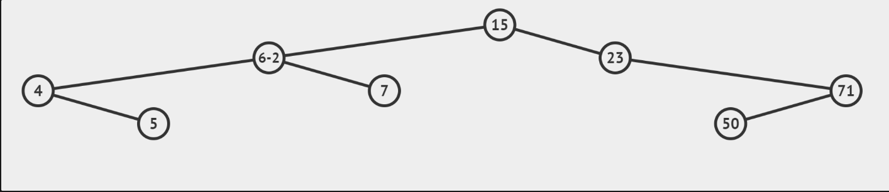

# In-order Traversal

```java
if this is null
  return //empty 
Inorder(left)
visit this
Inorder(right)
```



1. Start at the root node (21).
2. Traverse the left subtree of the root node.
a. Arrive at node 16.
b. Node 16 does not have a left child. Hence, there's nothing to traverse on its left.
c. Visit and list node 16.
d. Node 16 does not have a right child. Hence, there's nothing to traverse on its right.
3. After completing the traversal of the left subtree, visit and list the root node (21).
4. Traverse the right subtree of the root node.
a. Arrive at node 33.
b. Node 33 does not have a left child. Hence, there's nothing to traverse on its left.
c. Visit and list node 33.
d. Now, traverse the right subtree of node 33.
i. Arrive at node 50.
ii. Node 50 does not have a left child. Hence, there's nothing to traverse on its left.
iii. Visit and list node 50.
iv. Node 50 does not have a right child. Hence, there's nothing to traverse on its right.
5. With all nodes visited in the right subtree of the root node, the traversal of the entire tree is complete.

Resulting in-order traversal sequence: 16 → 21 → 33 → 50.

## Time Complexity

Inorder Traversal runs in O(**N**), regardless of the height of the BST. Every vertex is visited.

## Applications

### Tree Sort

BST Sorting

1. Insertion of **N** unordered integers into a BST in O(**N** log **N**) 
2. Performing the O(**N**) Inorder Traversal. 

> 💡 It is rarely used though as there are several easier-to-use (comparison-based) sorting algorithms than this. → Merge sort



## Pre-order Traversal

Visit the current root before going to left subtree and then right subtree. For the example BST shown in the background, we have: {{15}, {6, 4, 5, 7}, {23, 71, 50}}. 

## Post-order Traversal

Visit the left subtree and right subtree first, before visiting the current root. For the example BST shown in the background, we have: {{5, 4, 7, 6}, {50, 71, 23}, {15}}.