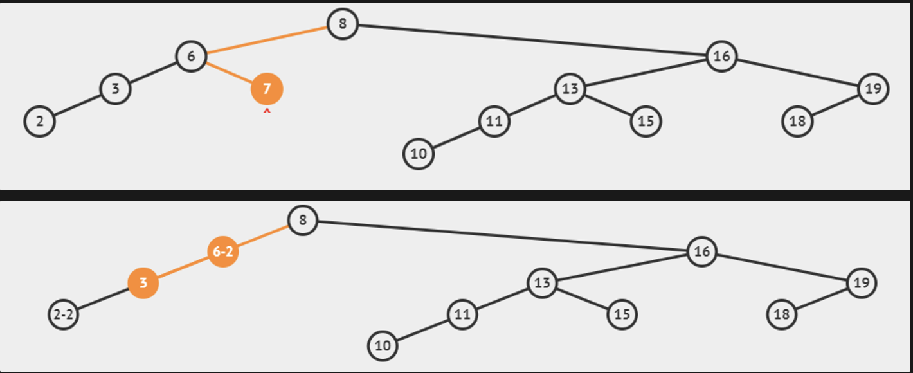
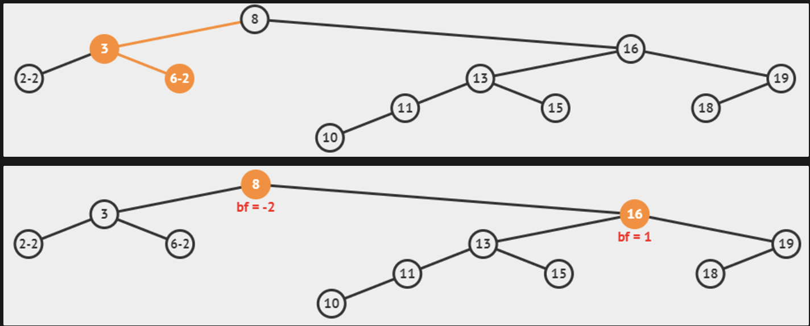
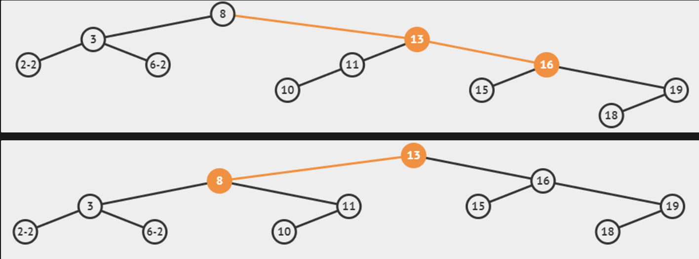

# Inserting and Removing Vertices

## Insert(v)

Essentially 99% similar implementation to search(v) but we create a new vertex instead of returning null if the new integer is not found. If there exists a vertex with that value already, we can just increase its frequency by one.

```java
if insertion point is found
  create new vertex
if value to be inserted < this key
  go left
else if value to be inserted > this key
  go right
else //value to be inserted == this key
	increment frequency
```

### Time Complexity

$O(h)$  time complexity, where $h$ is the height of the BST.

### AVL Tree Implementation

Time complexity = $O(\log N)$, $h = \log N$

We compute `x.height = max(x.left.height, x.right.height) + 1` at the back of the insert operation, to update the height and balance factor of vertices along the insertion path:

1. Walk up the AVL Tree from the insertion point back to the root and update the height and balance factor of affected vertex
2. Stop at the **first** vertex that is out-of-balance (+2 or -2), if any,
3. Use [**one** of the four tree rotation](https://www.notion.so/AVL-Tree-7930fec847374783af90c6343b2ab040?pvs=21) cases to rebalance it again
4. Continue traversing up until root and repeat Step 1

## Remove(v)

Essentially 99% similar implementation to search(v) but there can are several possible cases:

Firstly, search(v) → $O(h)$

1. If v is not in the BST, then we do nothing
2. If v is in the BST and freq of v ≥ 2, decrease its freq by 1
3. If v is in the BST and freq == 1, we perform one of 3 possible removals (another 3 cases):
    1. v is a current leaf vertex of the BST, remove that leaf vertex → $O(1)$
    2. v has one child, bypass v’s child to v’s parent (v is essentially ignored and “removed”) → $O(1)$
    3. v has 2 children, replace v with its **successor** and delete the successor (which is now a duplicate). Since the successor has the smallest value in the right subtree, it will have either no children (simple removal) or one child (bypass removal). → $O(h)$  for calling `successor(v)`

> 💡 We can also replace v with its predecessor but for the sake of CS2040S, we will assume that the implementation replaces with its successor

### Time Complexity

$O(h)$  time complexity, where $h$ is the height of the BST.

### AVL Tree Implementation

Time complexity = $O(\log N)$, $h = \log N$

We add the step to compute `x.height = max(x.left.height, x.right.height) + 1` at the back of the remove operation, to update the height and balance factor of affected vertices:

1. Walk up the AVL Tree from the deletion point back to the root and update the height and balance factor of affected vertex
2. Stop at the **first** vertex that is out-of-balance (+2 or -2), if any,
3. Use [**one**](https://www.notion.so/Binary-Search-Tree-bbf0a677957e4ddaac3bf1a774837a0e?pvs=21) [of the four tree rotation](https://www.notion.so/AVL-Tree-7930fec847374783af90c6343b2ab040?pvs=21) cases to rebalance it again
4. Continue traversing up until root and repeat Step 1

> 💡 In this implementation of `remove(v)` it is possible to trigger rebalancing cases several times, but not more than $h = O(\log N)$  times.



rotateRight(6) is invoked



Right-Left Case: rotateRight(16) + rotateLeft(8) is invoked


