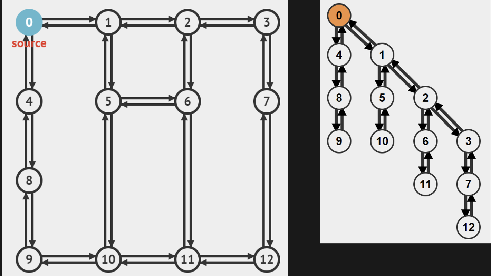

# Graph Traversal 

Given a grpah we can use $O(V+E)$  DFS or BFS algorithm to traverse the graph.

## Depth-First Search (DFS)

Implicit stack

Takes in source vertex, s → recursively perform a visitation sequence as deep as possible → backtrack and repeat if needed

status[] array that keeps track of vertices visited. DFS visit vertex only if vertex is unvisited

array, p[u] of size V to remember parent of each vertex u, along the DFS traversal path. p[source] is set to -1 


### Implementation

Using AL graph data structure allows for efficient traversal through the neighbors of a particular vertex because you directly access the list of neighbors. It supports performing DFS with O(V+E) time complexity because each adjacency list can be scanned in O(k) time for each vertex, where k is the number of neighbors, and every vertex and edge in the graph will be visited once in an undirected graph (or twice in a directed graph for both in-neighbors and out-neighbors).

### Time Complexity

$O(V+E)$ , each vertex is only visited once due to DFS only recursively exploring an unvisited vertex. Each time a vertex is visited, all $k$ neighbours are explored and therefore after all vertices are visited, we examined $E$  edges 

```java
Stack st;
HashSet<Node> visited;
st.push(source node);
while !st.isEmpty
			Node u = st.pop()
			visited.add(u)
			//do whatever else we need to do for Node u
			for every neighbour Node v of u
					if v not in visited
							st.push(v)
```

## Breadth-First Search (BFS)/Kahn’s Algorithm

Starts from source vertex s, uses queue to order visitation sequence as breadth as possible before going deeper

Visited and unvisited boolean array to keep track of vertices.



### Implementation

Using AL graph data structure allows for efficient traversal through the neighbors of a particular vertex because you directly access the list of neighbors. It supports performing DFS with O(V+E) time complexity because each adjacency list can be scanned in O(k) time for each vertex, where k is the number of neighbors, and every vertex and edge in the graph will be visited once in an undirected graph (or twice in a directed graph for both in-neighbors and out-neighbors).

### Time Complexity

$O(V+E)$

1. Each vertex is only visited once as it can only enter the queue once — O(**V**)
2. Every time a vertex is dequeued from the queue, all its **k** neighbors are explored and therefore after all vertices are visited, we have examined all **E** edges — (O(**E**) as the total number of neighbors of each vertex equals to **E**).

```java
Queue q;
HashSet<Node> visited;
q.offer(source node);
while !q.isEmpty
			Node u = q.poll()
			visited.add(u)
			//do whatever else we need to do for Node u
			for every neighbour Node v of u
					if v not in visited
							q.enqueue(v)
```


> 💭 The order in which vertices are visited can be seen as the distance away from the root node

## DFS or BFS?

Both will give the same result, in the sense that every node connected to the source node will eventually be visited exactly once. However, the order of visiting is different → affect runtime 

Things to consider:

- High search depth → recursive DFS will consume a lot of memory space for the recursion stack
- Nodes have high degree → BFS will consume a lot of memory space for the queue
- Shortest path → BFS is complete and will guarantee searching for the shortest path vs DFS which is not complete in infinite graphs and not necessarily the shortest. However, it might be preferred for its simpler implementation and lower memory usage in tree graphs specifically.
- Cyclic graphs → DFS Recursive error
- Topological sort → DFS preferred

## Applications

### Single-Source Shortest Paths (BFS) Unweighted Graphs

We can use BFS to help us find the shortest path if the graph contains edges that are unweighted/constant weights. Then the SSSP would just be finding the path with least number of edges. 

Instead of setting visited[u] = false, we set D[u] = $10^9$  and set D[s] = 0

BFS main loop change

Before

After

```java
if !visited[v]:
		visited[v] = 1 
		...
```

```java
if D[v] == 10^9
		D[v] = D[u] + 1 //unweighted so just one step away
		...
```

Note that BFS is not designed for weighted graphs SSSP problem, and will most likely output the wrong answer (when taking more edges has less weight than taking min num edges)

#### Time Complexity

$O(V+E)$ BFS >>>> Bellman-Ford’s $O(V*E)$  solution

### Single-Source Shortest Paths (DFS/BFS) Trees

We can use DSF/BFS to find SSSP for (weighted) trees → there is only one unique acyclic path that connects 2 distinct vertices.

Note that this is only applicable for tree graphs as DFS only processes the first visitation instance from previous vertices and hence will not consider future, albeit less-weighted edges. 

#### Time Complexity

$O(V)$ 🤯 Note that in trees, $E = V-  1$, $O(V+E) = O(V+V-1) \approx O(V)$

### Reachability Test

Given source and target vertex, $s, \text{and } t$, $t$ is reachable if `status[t] = visited` after calling `DFS(s)`

#### Time Complexity

$O(V+E)$ DFS/BFS, then $O(1)$  array indexing

### Printing Traversal Path

Note that we set `p[v] = u` every time we extend the DFS/BFS traversal from vertex $u$  to vertex $v$

We call DFS/BFS on the source vertex, then backtrack($u)$ recursively until it goes back to the source vertex.

```java
backtrack(u)
  if (u == -1) 
			stop
  backtrack(p[u]);
  output vertex u in reverse
```

Note that the path output needs to be reversed

#### Time Complexity

$O(V+E)$ DFS/BFS then $O(V)$  backtracking

### Identifying a Connected Component

Call DFS/BFS on source vertex, then enumerate all vertices that `status[v] = visited`

These vertices all form one connected component (including the source vertex)

#### Time Complexity

$O(V+E)$ DFS/BFS then $O(V)$  enumerating all vertices

### Counting number of Connected Components

```java
CC = 0
for all u in V, 
		status[u] = unvisited //all vertices are unvisited at first
for all u in V
  if (status[u] == unvisited) 
    ++CC //minimum 1
    DFS(u) //visit vertices in the same component of u
output CC
```

#### Time Complexity

 $O(V+E)$ DFS/BFS 

Each vertex is still only being visited once, and each edge is visited once. Therefore, the total time complexity is O(V+E). We don’t perform DFS/BFS from every single vertex regardless of whether it has been visited before; such an approach would indeed have a time complexity of O(V*(V+E)) = O(V^2 + VE).

### Detecting Cycle

Back edge can be detected by modifying array **status[u]** to record **three** different states:

1. **unvisited**: same as earlier, DFS has not reach vertex **u** before,
2. **explored**: DFS has visited vertex **u**, but at least one neighbor of vertex **u** has not been visited yet (DFS will go depth-first to that neighbor first),
3. **visited**: now stronger definition: all neighbors of vertex **u** have also been visited and DFS is about to backtrack from vertex **u** to vertex **p[u]**.

A back edge is identified when a edge explores an already explored vertex 

> 💭 If we had only used binary states unvisited/visited, we cannot distinguish between explored and fully visited

## Topological Sort

On a directed acyclic graph, linear ordering of the DAG's vertices in which each vertex comes before all vertices to which it has outbound edges. Topological sorting is often not unique 

### Toposort (DFS)

```java
for each unvisited vertex u
		DFS(u)
			for each neighbour v of u
			if v is unvisited, DFS(v)
		else skip v
		finish DFS(u), add u to the back of the list
reverse list
```

> 💭 One of the main purpose for toposort is for Dynamic Programming Technique

### Toposort (BFS)

Kahn’s Algorithm

```java
Queue q;
add vertices with in-degree == 0 to q
		while !q.isEmpty()
				Node u = q.pop()
				for each neighbour v of u
						delete edge(u,v)
						if v.in-degree == 0
								q.enqueue(v)
```

> 💡 We can play with the data structure for Kahn’s Algorithm ie Queue replaced with Stack, so long as we only add the vertex when there is **no incoming edge**

We can use a in-degree counter array for vertices as well and decrease the in-degree when processing the nodes

### Topological Sort Analysis

Upper Bound: DAG has no edges then there are $V \text{ vertices with }V!$ possible topological orderings 

Lower Bound: DAG is a linked list/degenerate tree with $E = V - 1$  edges so it has only 1 unique topological ordering