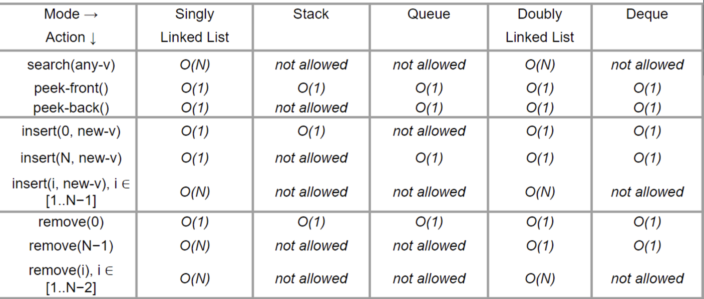

# List ADT

1. get(i) — maybe a trivial operation, return $a_i$ (0-based indexing),
2. search(v) — decide if item/data **v** exists (and report its position/index)or not exist (and usually report a non existing index -1) in the list,
3. insert(i, v) — insert item/data **v** specifically at position/index **i** in the list, potentially shifting the items from previous positions: [**i**..**N**1] by one position to their right to make a space,
4. remove(i) — remove item that is specifically at position/index **i** in the list, potentially shifting the items from previous positions: [**i+1**..**N**1] by one position to their left to close the gap.

