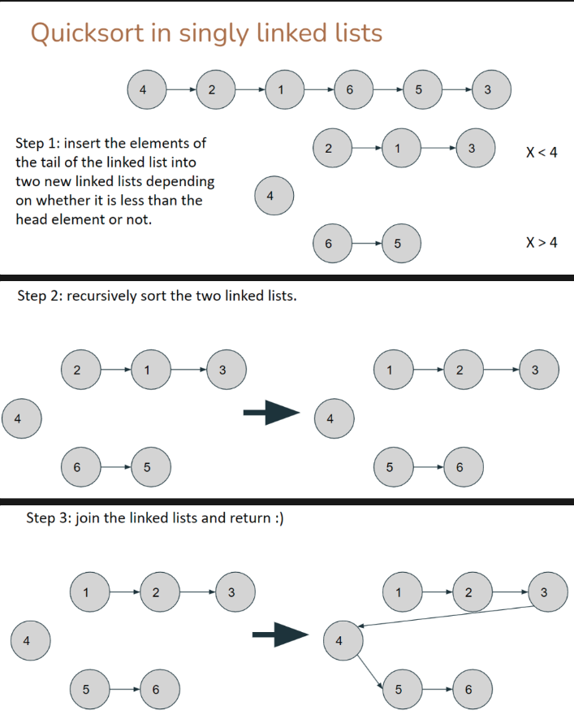

# Singly-Linked Lists

## Properties

- Head and tail pointer
- Every node has a next pointer

### Getting/Searching Elements

Sequential access from head element. O(N)

Best case, v found at first pos. O(1)

Worst case, v not found in list, required O(N) scan to determine.

> 💡 peekFront() and peekBack() are exceptions that use the head/tail pointer for instant $O(1)$ access

### Inserting Elements

- Insert at head, before current first item. O(1) using head pointer to help.
    - Create new node
    - Set node → next to head
    - Replace head pointer with pointer to new node
- Insert in empty linked list (similar implementation to insert at head)
- Insert at position beyond last item (current tail). O(1) using tail pointer to help
    - Create new node
    - Set tail → next to new node
    - Replace tail pointer with pointer to new node
- Other positions within linked list. worst case insert at i = N-1 where we need to find the item N-2 before the tail → O(N).

### Removing elements

#### Legal

- Remove head, affects head pointer
    - Set head pointer to head → next (node), remove node. O(1).
- Remove tail, affects tail pointer
    - Traverse to node before the tail, set node → next to `null`, set tail pointer to node, O(N)
- Other positions
    - Traverse to index, bypass the index node by connecting the previous node → next to [node.next](http://node.next) of the node to be removed. O(N).

#### Illegal

- LinkedList is empty ie if `(head == Null)`

## Sorting Singly Linked Lists

We can perform either merge sort or quicksort easily in O(N log N). In fact, any of the sorting algorithms we learnt before works!

