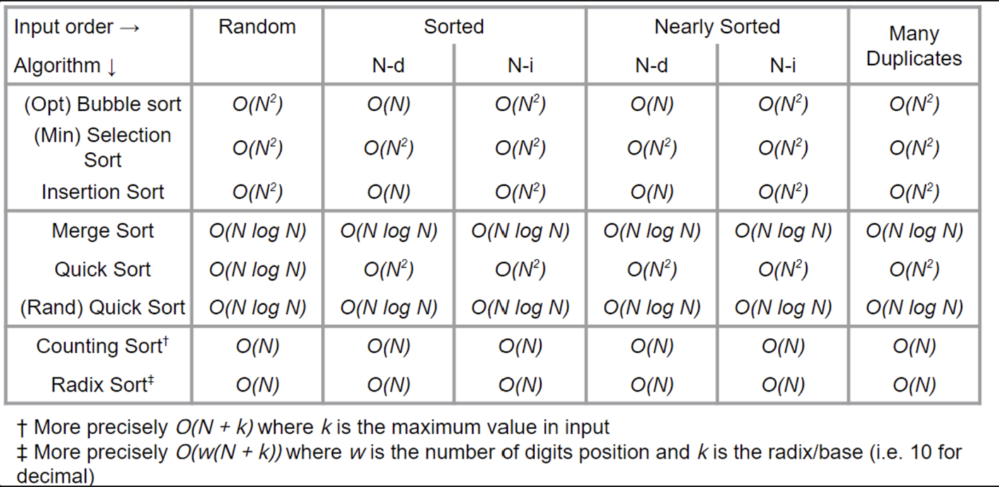

# Sorting

## Overview

### Comparison Sorting Algorithms

- [Bubble Sort](./sorting/bubble-sort.mdx)
- [Selection Sort](./sorting/selection-sort.mdx)
- [Insertion Sort](./sorting/insertion-sort.mdx)
- [Merge Sort](./sorting/merge-sort.mdx)
- [Randomised Quick Sort](./sorting/randomised-quick-sort.mdx)
- [Quick Sort vs Merge Sort](./sorting/quick-sort-vs-merge-sort.mdx)

> 💡 Comparison Based Algorithms must make at least $O(n\log n)$ comparisons

### Non-comparison Sorting Algorithms

- [Counting Sort](./sorting/counting-sort.mdx)
- [Radix Sort](./sorting/radix-sort.mdx)

### Applications of Sorting Algorithms

- [Quick Select](./applications-for-sorted-arrays/quick-select.mdx)
- [Binary Searching](./applications-for-sorted-arrays/binary-searching.mdx)
- [Order Statistics](./applications-for-sorted-arrays/order-statistics.mdx)
- [Uniqueness Operation](./applications-for-sorted-arrays/uniqueness-operation.mdx)
- [Counting Specific Elements](./applications-for-sorted-arrays/counting-specific-elements.mdx)
- [Intersection/Union of 2 Arrays](./applications-for-sorted-arrays/intersection-union-of-2-arrays.mdx)
- [Finding Target Pairs](./applications-for-sorted-arrays/finding-target-pairs.mdx)
- [Counting Values in Range](./applications-for-sorted-arrays/counting-values-in-range.mdx)

### In-built Java Packages

Java Collections.sort (stable Timsort → variation of merge sort)

For primitives Java Arrays.sort (non-stable Dual-Pivot Quicksort, Quicksort variant)

For non-primitives (including Strings) Java Arrays.sort (stable Timsort → variation of merge sort)