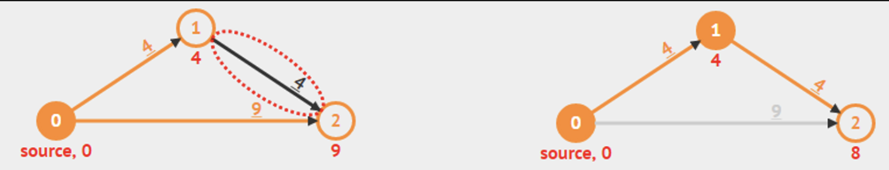

# Single-Source Shortest Paths

## Objectives

1. Find the shortest path weights from a particular source vertex to **all** other vertices in a directed weighted graph (if the path exists) 

$
\forall u \in V, \text{ find the shortest path weight from } s \text{ to } u \rightarrow \delta(s, u)
$

    
2. Find the actual shortest path from $s \text{ to } u$

## Output of SSSP Algorithms

1. Array D of size V → (Distance from $s \text{ to } u$)
    1. Initially, $D[u] = 0$ if u = s; otherwise $D[u] = +∞$  (a large number, e.g. $10^9$)
    2. $D[u] ≥ δ(s, u)$  throughout the execution of SSSP algorithms but decreases as we find better (shorter) paths 
    3. $D[u] = δ(s, u)$ at the end of SSSP algorithm
2. Array p of size V → ('parent'/'predecessor'/'previous'). 
This array/Vector p describes the resulting SSSP spanning tree
    1. $p[u] =$  the predecessor on best path from source $s \text{ to } u$
    2. $p[u] = NULL$ (not defined, we can use a value like -1 for this)

## Relax

```java
relax(u, v, w(u,v))
  if D[v] > D[u] + w(u,v) // if the path can be shortened
    D[v] = D[u] + w(u,v) // we 'relax' this edge
    p[v] = u // remember/update the predecessor
    // update some other data structure(s) as necessary
```

Example `relax(1, 2, 4)`



## Implementations of SSSP Algorithms

Confirm plus chop 100% cfm will be correct algorithm unless negative weight cycle:

$O(V*E)$ 

[Bellman-Ford Algorithm](./sssp/bellman-ford.mdx)

On unweighted graphs or uniform weight, 

[Breadth-First Search](./graph-traversal.mdx#single-source-shortest-paths-dfsbfs-trees)

On Graphs without negative weight: $O((V+E) log V)$ 

[Dijkstra’s Algorithm](./sssp/dijkstra.mdx)

On Graphs without negative weight cycle:

$O((V+E) \log V)$ [Modified Dijkstra's Algorithm](./sssp/dijkstra#modified-dijsktras-algorithm)

On Tree:

 $O(V+E)$  [DFS/BFS](./graph-traversal.mdx),

On Directed Acyclic Graphs (DAG):

 $O(V+E)$ 

[Dynamic Programming (DP)](./sssp/dynamic-programming.mdx)

## Notable

1. The weight of the shortest path from $s \to s$ is 0 (trivial)
2. The weight of the shortest path from $s \to \text{unreachable vertex}$ is $+ \infin$ (trivial)
3. Weight of shortest path from $s \to v \text { does not necessarily } = w(s,v)$
4. It is okay for edges to have negative weight but the problem comes when a negative weight cycle exists then the shortest path becomes ill-defined as we would want a weight of $- \infin$