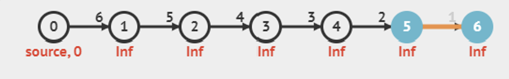

# Bellman-Ford Algorithm

Most versatile but slowest SSSP Algorithm

Pseudocode:

```java
for i = 1 to |V|-1 // O(V) time complexity
  for each edge(u, v) ∈ E // O(E) time complexity, iterating through an Edge List
    relax(u, v, w(u, v)) // O(1)
```

## Rationale

1. All the values in d are first initialised with a very large number $(e.g. \space 10^9)$ which have “no effect” when attempting to relax it
2. The V-1 for loop works because the maximum number of edges in the path from any 2 vertices will be V-1, provided that they are connected and do not have a negative weighted loop
3. Depending on the order in which the edge list is configured, as we loop through the edges in the edge list and update distance of vertices

## Time Complexity

$O(V*E)$

Minimum = 1 loop $O(E)$  operations

Edge list is configured perfectly such that only 1 loop is needed to set the correct distance of each vertex

Maximum = V-1 loops $O((V-1) * E)$  operations



After 1st loop weight of vertex 1 set to 6

After 2nd loop weight of vertex 2 set to 11

…

> 💭 In a complete graph, $E = V*(V-1)/2$  

Time complexity of Bellman-Ford Algorithm for complete graphs: 
$O((V-1)*V*(V-1)) \approx O(V^3)$


## Problems Arising

- Bellman-Ford algorithm can handle input graphs with positive weight cycles
- Bellman-Ford algorithm can handle input graphs with negative weights but…
- Bellman-Ford algorithm cannot handle input graphs with negative weight cycles
- However, it might be useful to use this algorithm to **identify** the existence of these negative weight cycle
- Run edge iteration loop one more time and if can still relax → there exists a $-\infin$  cycle