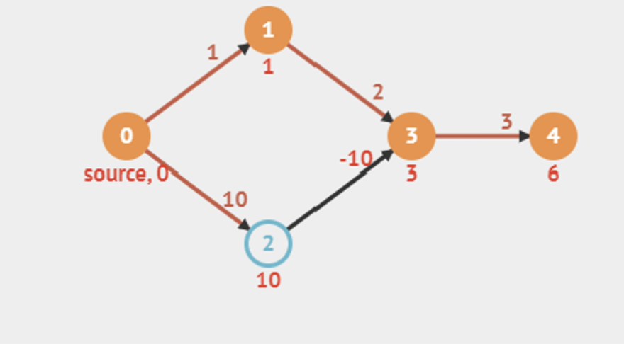

# Dijsktra's Algorithm

Dijkstra's Algorithm is the most frequently used SSSP algorithm for directed weighted graphs with **no negative weight edges.** Such weighted graphs are quite common → travelling places requires time (weight)

## Implementation

Maintain a set S (solved) of vertices whose final shortest path have been determine, initialised as 

$
S = \{s\} , \text{where s is the source vertex}
$

Repeated select vertices in $V \setminus S$ , in a greedy strategy, with the minimum shortest path estimate and adds $u$  to $S$

We use a Priority Queue (implemented by AVL) to keep track of the most optimal edges as the shortest path estimates are continuously modified. Note that we need to change the keys of the priority queue, so using a bBST is somewhat easier.

## Time Complexity

$O((V+E) \log V)$

Each vertex is extracted from the PQ only once. As there are V vertices, we do this maximum $O(V)$  times. ExtractMin() runs in $O(\log V)$ whether the PQ is implemented using a Binary Min Heap or bBST (AVL Tree) → $O(V\log V)$

When processing each vertex, we relax its neighbours, where $E$  edges are processed. If we manage to successfully find a shorter distance by relaxing, then we need to modify the entry (DecreaseKey() in min heap; Delete and re-insert in bBST) in $O(\log N)$ time →  $O(E \log V)$

In total $O(V\log V) + O(E\log V) = O((V+E)\log V) >>> O(V*E)$ Bellman-Ford

## Problems Arising

Due to the greedy nature of Dijkstra’s algorithm, we cannot propagate it when the graph contains negative values because it does not extensively test all possible pathways, rather it always takes the least weighted path.



Example: Using Dijsktra, we will get 0 → 1 → 3 with weight 3 but actually the most efficient would be 0 → 2 → 3 with weight 0. 

## Modified Dijsktra’s Algorithm

In this modified implementation, we can use it for graphs with negative weight edges but not negative weight cycles.

The idea is that we lazily update the minimum shortest path estimates, such that we do not remove the outdated/weaker/bigger-valued edges. 

```jsx
int[] distance = new int[N];
set all distance to all vertices as inf
d[v] = 0
PriorityQueue<Integer, Integer> pq = new PriorityQueue<>(); //weight, vertex 
put (src, 0) into pq
while (pq is not empty) {
		d, u = pq.pop()
		if d > d[u]: continue
		for all neighbouring vertex, v,
				if (d[v] > d[u] + w(u,v)) 
						d[v] = d[u] + w(u,v)
						insert (v, d[v]) in pq
```

## Rationale

We still always process the shortest edges to the destination vertices first 

## Time Complexity

When there are no negative weights, the modifited implementation is exactly the same as its original so time complexity is still $O((V+E)\log V)$.

However, when there exist a negative weight edge, the algorithm continues propagating after it has found the better alternative subpath, and corrects the initially greedy output. This is at the expense of a higher run time →