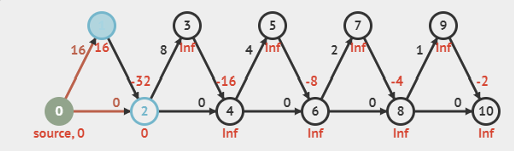

# Dynamic Programming (DP)

Applicable when the input graph is a Directed Acyclic Graph (DAG).

## Rationale

1. We find one topological order of the DAG (using DFS/BFS)
2. Go through each vertex in topological order
3.  At each vertex, relax all outgoing edges of it

## Implementation

```java
order = Topo sort input DAG //O(V+E) topological sort
while !order.isEmpty() { //O(V) 
		u = order.getFront()
		for neighbour v of u
				relax(u, v, w(u,v))
```

## Time Complexity

$O(V+E)$. After one pass, we will have the correct values in array D for all vertices.

## Problems Arising

- Works extremely fast for some DAG compared to Modified Dijsktra’s Algorithm e.g.:



- Does not work for any cyclic graphs → no topological ordering

> 💭 Realise how DP algorithm is actually a one-pass Bellman-Ford algorithm, replacing the outermost V-1 loop (which was necessary because we didn’t know the correct order so we just repeat max possible).